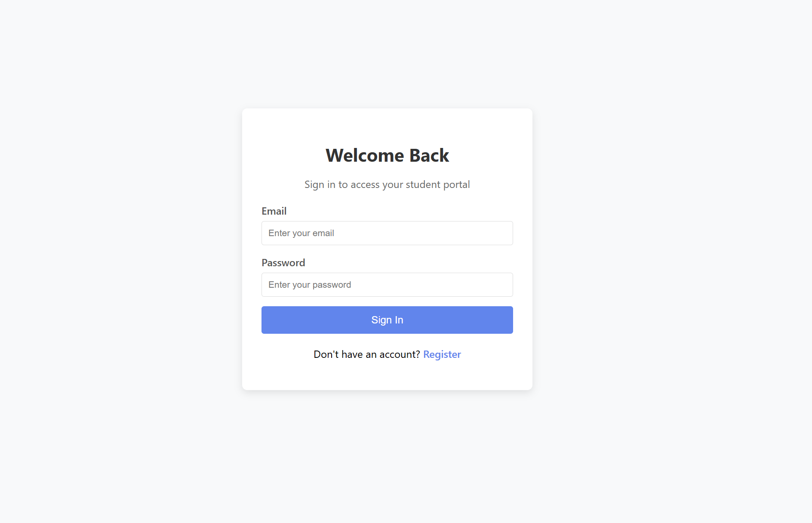

[← Grįžti į dokumentacijos pradžią](../README.md)

# Studentų Sistemos Vartotojo Vadovas

## Turinys
1. [Įvadas](#įvadas)
2. [Sistemos reikalavimai](#sistemos-reikalavimai)
3. [Prisijungimas prie sistemos](#prisijungimas-prie-sistemos)
4. [Studentų funkcionalumas](#studentų-funkcionalumas)
5. [Dėstytojų funkcionalumas](#dėstytojų-funkcionalumas)
6. [Administratoriaus funkcionalumas](#administratoriaus-funkcionalumas)
7. [Dažniausiai užduodami klausimai (DUK)](#dažniausiai-užduodami-klausimai-duk)

## Įvadas

Šis vartotojo vadovas skirtas Studentų sistemos naudotojams. Vadovas pateikia išsamią informaciją apie tai, kaip naudotis sistema, priklausomai nuo jūsų rolės (studentas, dėstytojas arba administratorius).

Studentų informacinė sistema (StudentPortal) yra išsami švietimo valdymo sistema, sukurta palengvinti studentų, dėstytojų ir administratorių bendravimą. Sistema leidžia efektyviai valdyti vartotojų profilius, peržiūrėti ir atnaujinti akademinius įrašus, planuoti užsiėmimus ir atlikti administracines operacijas.

## Sistemos reikalavimai

Norint naudotis Studentų informacine sistema, reikalinga:

- Interneto naršyklė (rekomenduojama Chrome 89+, Firefox 86+, Edge 89+ arba Safari 14+)
- Stabilus interneto ryšys
- Galiojanti paskyra sistemoje

Sistema optimizuota ir kompiuteriams, ir mobiliesiems įrenginiams, todėl galite patogiai naudotis ja iš bet kurio įrenginio.

## Prisijungimas prie sistemos

### Prisijungimo žingsniai

1. Atidarykite savo naršyklėje puslapį http://example.com/student-portal (pakeiskite example.com jūsų mokyklos domenu)
2. Prisijungimo puslapyje įveskite savo el. pašto adresą ir slaptažodį
3. Spauskite mygtuką "Sign In"

## Studentų funkcionalumas

### Pagrindinis valdymo skydelis

Prisijungus studentui, rodomas pagrindinis valdymo skydelis, kuriame matysite:

- Jūsų šiandieninį paskaitų tvarkaraštį
- Naujausiai gautus pažymius
- Svarbių datų (atsiskaitymų, egzaminų) priminimus
- Bendrą informaciją apie jūsų studijas

### Pažymių peržiūra

Studentai gali peržiūrėti savo pažymius:

1. Pagrindiniame meniu pasirinkite "Pažymiai"
2. Matomas visų dalykų pažymių sąrašas
3. Peržiūrėkite detalią informaciją apie kiekvieną pažymį, įskaitant komentarus ir datą

Pažymiai grupuojami pagal dalyką, o kiekvienam dalykui skaičiuojamas bendras vidurkis.

### Tvarkaraščio peržiūra

Studentai gali peržiūrėti savo paskaitų tvarkaraštį:

1. Pagrindiniame meniu pasirinkite "Tvarkaraštis"
2. Matomas jūsų savaitinis tvarkaraštis
4. Galite matyti dalykos detales (auditorija, dėstytojas, trukmė)

### Profilio valdymas

Norint atnaujinti asmeninę informaciją:

1. Paspauskite savo vartotojo piktogramą viršutiniame dešiniajame kampe
2. Pasirinkite "Profilis"
3. Atnaujinkite savo kontaktinę informaciją "Asmeninė informacija" skiltyje
4. Pakeiskite slaptažodį "Saugumas" skiltyje

## Dėstytojų funkcionalumas

### Pagrindinis valdymo skydelis

Prisijungus dėstytojui, rodomas pagrindinis valdymo skydelis, kuriame matysite:

- Pranešimus
- Studentų statistiką

### Pažymių įvedimas

Įvesti naują pažymį:

1. Atidarykite studentų sąrašą
2. Paspauskite mygtuką "Gradebook" ir pasirinkite studentą pagal ID
3. Įveskite pažymio informaciją (dalykas, pažymys, data, komentarai)
4. Paspauskite "Išsaugoti"

Pažymiai nedelsiant matomi studentams jų aplinkoje.

## Administratoriaus funkcionalumas

### Vartotojų valdymas

Administratoriai gali valdyti visus sistemos vartotojus:

1. Pagrindiniame meniu pasirinkite "Admin Panel"
2. Spustelėję ant vartotojo, galite:
   - Redaguoti jų informaciją
   - Keisti jų rolę
   - Aktyvuoti/deaktyvuoti paskyrą
   - Atstatyti slaptažodį

### Naujų vartotojų kūrimas

Naujo vartotojo sukūrimas:

1. Vartotojų valdymo puslapyje paspauskite mygtuką "Pridėti naują vartotoją"
2. Pasirinkite vartotojo rolę (studentas, dėstytojas, administratorius)
3. Įveskite vartotojo informaciją (vardas, pavardė, el. paštas)
4. Nustatykite papildomą informaciją priklausomai nuo rolės
5. Paspauskite "Sukurti"

### Sistemos nustatymai

Administratoriai gali konfigūruoti sistemos nustatymus:

1. Galite konfigūruoti:
   - Puslapio pavadinimo keitimas
   - Viešos registracijos uždarymas
   - Pagalbos email keitimas
   - Puslapio išjungimas
3. Atlikę pakeitimus, paspauskite "Išsaugoti nustatymus"

Sistemos nustatymai taikomi visai sistemai iš karto.